
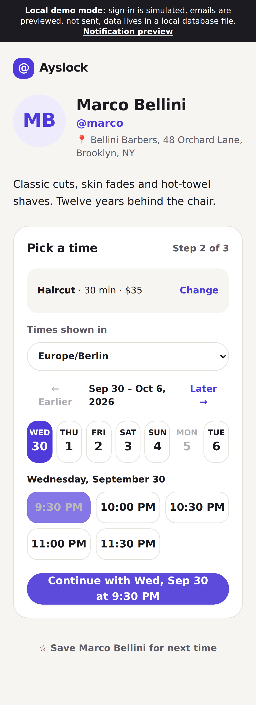
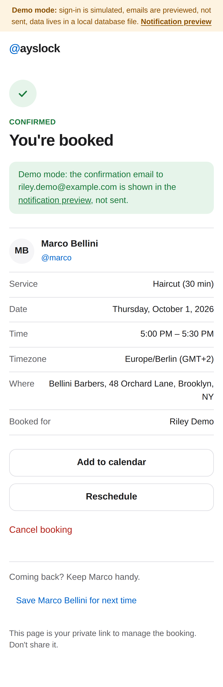
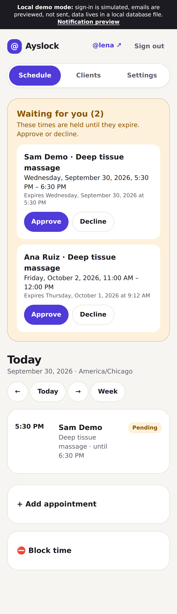

# Ayslock

Ayslock lets people book time with a service provider using their @username. A barber, trainer, tutor, or consultant creates a profile, adds their services, and sets available hours. They share their username or link: “Here’s my Ayslock: @adam.”

> Find your person. Pick a time. You’re booked.

This repository is a working MVP: a mobile-first Next.js app where clients look up a provider by exact username, pick a service and a time, and book without an account. Providers sign up, set services and hours, and manage a simple schedule.

| Home | Pick a time | Booked | Provider schedule |
| --- | --- | --- | --- |
|  |  |  |  |

More screens are in [`docs/screenshots`](docs/screenshots).

## Quick start (local demo mode, no accounts needed)

```bash
npm install
npm run dev
# open http://localhost:3000
```

With no environment variables set, Ayslock runs in **local demo mode**, and a dark banner on every page says so:

- **Database:** an embedded Postgres ([PGlite](https://pglite.dev)) stored in `.data/pglite`. It runs the same SQL migrations, constraints and queries as production. `npm run demo:reset` wipes it and re-seeds on next start.
- **Sign-in is simulated:** passwords are hashed and stored in the local database, and no email is verified. This is not production authentication.
- **Emails are not sent:** every confirmation, reminder and approval is rendered at [`/demo/outbox`](http://localhost:3000/demo/outbox) (the "Notification preview"). That page only exists while sign-in is simulated.

### Running the demo on Vercel

Vercel runs your app on several short-lived server instances, and they don't share files. Without a database, each instance keeps its own temporary copy of the demo data. A sign-up on one instance is unknown to the next, so you get signed out, bookings seem to vanish, and times fail to load. The banner warns about this.

The fix is a shared database. You don't need Supabase Auth or email for a working demo:

1. In Vercel, open your project → **Storage** → **Create Database** → **Neon** (free), and connect it to the project. This sets `POSTGRES_URL` / `DATABASE_URL` for you. A Supabase project also works: copy its **Session pooler** connection string into `DATABASE_URL`.
2. Redeploy.

On first start, the app creates its tables and loads the demo profiles by itself. It's safe when several instances start at once. Sign-in is still labeled simulated, and emails still go to `/demo/outbox`, but everything persists and works across instances. `APP_SECRET` is optional here: without it, links are signed with a key derived from the database URL.

### Demo profiles

All fictional. Password for every demo account: `ayslock-demo`.

| Profile | Sign in as | Booking mode | What to try |
| --- | --- | --- | --- |
| [`/u/marco`](http://localhost:3000/u/marco) Marco Bellini, barber, Brooklyn | `marco@example.com` | Open | Book instantly, reschedule, cancel, add to calendar |
| [`/u/lena`](http://localhost:3000/u/lena) Lena Okafor, massage therapist, Chicago | `lena@example.com` | Approval required | Request a time, then approve it as Lena |
| [`/u/sofia`](http://localhost:3000/u/sofia) Sofia Lindqvist, online tutor, London | `sofia@example.com` | Private | Ask for access, approve as Sofia, open the private link from `/demo/outbox`, then revoke it |

You can also create a new provider at `/signup`.

## What works

**Clients**
- Home page centered on “Enter your provider's @username.” Accepts `@name`, `name`, any case. Unknown names get a friendly message; there is no search, listing or directory, and profiles are `noindex`.
- Profile at `/u/<username>`: name, avatar (initials if none), @username, bio, location or online details, services with duration and optional price.
- Booking: service → date and time → name and email (phone and note optional) → confirm. Times are shown in the browser's timezone by default, with a timezone picker; the final summary shows the full date and the timezone.
- Only slots that fit the whole service inside working hours, outside breaks, after the minimum notice, inside the booking window, and clear of other appointments plus the buffer are offered.
- If a slot is taken between picking and confirming, the client gets “Someone just booked that time. Please pick another one.” and fresh times.
- Confirmation page (also the private manage link): service, provider, date, time, duration, timezone, location; `.ics` download; reschedule; cancel; save the provider on this device (localStorage, shown on the home page).

**Providers**
- Sign up / sign in, then a three-step onboarding: name, username, timezone, bio, location → services → weekly hours with breaks (prefilled Monday to Friday, 10:00 to 19:00).
- Finish screen: “Your Ayslock is ready.” with the link, a copy button and a downloadable QR code.
- Schedule: day list with week view, pending requests to approve or decline, access requests, add an appointment manually, block time, reschedule and cancel.
- Clients: list with visits and next/last appointment, history per client, private notes.
- Settings: profile, services (add, edit, hide, delete), weekly hours, date-specific days off and special hours, minimum notice, booking window, buffer, request hold time, private link validity, and booking access mode.

**Booking access modes**
- **Open:** book instantly.
- **Approval required:** the client sees times and sends a request, clearly labeled pending. The request holds the slot until it's approved or expires. The hold lasts `pending_expiry_hours` (default 24, set in Settings) and never past the appointment start. Expired requests are released automatically and the client is told.
- **Private:** the profile and services are visible by exact username, but times are not. Clients submit name, email and an optional note. When approved, they get a private link (`/u/<name>?k=…`) valid for `access_link_days` (default 30). The provider can turn it off at any time. The server refuses to return slots or accept bookings without a valid link, so hidden availability is never sent to the browser.

**Notifications**
- Confirmation (or "request received") to the client and a new-booking email to the provider.
- Reminder 24 hours before, sent by the background job (see setup step 5; without a scheduler, no reminders go out). Bookings made less than 24 hours ahead get only the confirmation.
- Emails for approval, decline, expiry, cancellation (either side) and reschedule; access request, approval and decline.
- Reminders are cancelled on cancel or reschedule, and a new one is queued for the new time. The worker also re-checks that the appointment is still confirmed at the same start time before sending, so a reminder can never go out for a cancelled or moved booking.

## Setup for production (Supabase + Resend)

1. **Create a Supabase project.** Copy `.env.example` to `.env.local` and fill in:
   - `DATABASE_URL`: the Postgres connection string (Project Settings → Database).
   - `NEXT_PUBLIC_SUPABASE_URL`, `NEXT_PUBLIC_SUPABASE_ANON_KEY`: Project Settings → API.
   - `APP_SECRET`: `openssl rand -hex 32`. It signs manage and access links; changing it invalidates every link already sent.
   - `APP_URL`: your public URL.
2. **Migrations** run automatically on first start, including the row level security policies when the database is a Supabase project. You can also apply them yourself with the Supabase CLI (`supabase db push`) or `DATABASE_URL=… npm run db:migrate`. The app recognizes a schema created either way. On Vercel, use Supabase's **Session pooler** connection string: the direct one is IPv6-only.
3. **Auth:** in Supabase → Authentication → URL configuration, set the site URL to `APP_URL` and add `APP_URL/auth/callback` as a redirect URL. If email confirmation is on, new providers confirm their email before onboarding.
4. **Email:** create a [Resend](https://resend.com) API key and verified sending domain, then set `RESEND_API_KEY` and `EMAIL_FROM`.
5. **Background job (needed for automatic reminders):** the repo ships no schedule, so it deploys on any host, including Vercel Hobby. Confirmations and other emails are attempted right after each booking change, but 24-hour reminders, and anything still queued (such as retries after a failed send), only go out when something calls the job. Set `CRON_SECRET`, then have an external scheduler call `GET /api/cron/notifications` with `Authorization: Bearer $CRON_SECRET` every 5 minutes. Until that's set up, no reminders are sent. Options:
   - A free external cron service (for example cron-job.org or a GitHub Actions `schedule` workflow) calling the URL with the header.
   - Supabase: `pg_cron` + `pg_net` calling the URL.
   - Vercel Pro: add a `crons` entry for `/api/cron/notifications` in `vercel.json`. Vercel sends the bearer token automatically when `CRON_SECRET` is set. Hobby only allows daily crons, which is too slow for reminders.
   - Any server: `npm run worker` from cron (same logic, one pass).
   The job is safe to run concurrently or retry: rows are claimed with `FOR UPDATE SKIP LOCKED` under a 5-minute lease, each email carries an `Idempotency-Key` for Resend, and enqueueing is deduplicated by key.
6. `npm run build && npm start`, or deploy to Vercel or any Node host.

Each part is independent. The banner lists whatever is still simulated. For example, with `DATABASE_URL` set but no Supabase keys, the database is real and sign-in is still labeled simulated.

## How it's built

- **Stack:** Next.js 16 (App Router, server actions, route handlers), TypeScript, Tailwind CSS 4, Postgres (Supabase), Supabase Auth, Luxon for timezones, Zod for validation.
- **Schema:** `supabase/migrations/20260930000001_schema.sql` (tables, checks, constraints) and `…02_rls.sql` (RLS policies). `db/demo.sql` adds the demo-only sign-in tables.
- **Time:** every timestamp is `timestamptz` (UTC). Providers store an IANA timezone; each appointment snapshots the provider's timezone and the client's. Working hours are local wall-clock minutes, converted per date, so daylight saving shifts are handled. Start times that don't exist (spring forward) are never offered, and a service always lasts its real duration.
- **Double booking** is prevented by the database, not only by the app:
  ```sql
  exclude using gist (provider_id with =, tstzrange(starts_at, occupied_until, '[)') with &&)
    where (status in ('pending', 'confirmed'))
  ```
  `occupied_until` is the end plus the provider's buffer. This covers client bookings, pending requests, manual appointments and blocked time alike. The app also rechecks the slot inside the booking transaction, so a request for a slot outside hours is refused even when nothing overlaps.
- **Booking states:** `pending → confirmed | declined | expired | cancelled`, `confirmed → cancelled`. Rescheduling moves the same row, and the constraint checks the new time. In approval mode, a client's reschedule goes back to pending.
- **Links:** manage links (`/b/<token>`) and private access links are `<record id>.<HMAC-SHA256>` signed with `APP_SECRET`, scoped by purpose (a manage token can't open private availability, and the reverse) and bound to one record. They are never stored. A manage link opens one appointment; bumping `token_version` revokes it. Access links stop working when revoked or expired. Manage pages send `Referrer-Policy: no-referrer`, and the site default is `same-origin`, so tokens never leak to other sites through the Referer header.
- **Privacy:** the public profile and slot endpoint only ever return start times. Every dashboard query is scoped by the signed-in provider's id, and client notes are only readable there. With RLS on Supabase, anonymous API keys can read nothing, and a signed-in provider can only reach their own rows.
- **Abuse protection:** Postgres-backed rate limits on lookups, slot queries, bookings (per IP and per email), access requests, reschedules, sign-up and sign-in; a honeypot field on public forms; at most one pending access request per email.

## Checks

```bash
npm run typecheck   # tsc
npm run lint        # eslint
npm test            # unit + integration tests on in-memory PGlite
npm run test:pg     # same integration tests on a real Postgres server (set TEST_DATABASE_URL)
npm run e2e         # Playwright, phone viewport, fresh demo database
```

What the tests cover:

- **Slot generation** (`tests/slots.test.ts`): whole-duration fit, breaks, buffers on both sides, minimum notice, horizon, closed days and special hours, US spring-forward and fall-back days, skipped local times, and a provider east of UTC.
- **Booking rules** (`tests/booking.test.ts`, on PGlite and on Postgres 16):
  - 20 simultaneous bookings for one slot give exactly 1 success and 19 "slot taken".
  - Overlapping manual/block inserts are rejected by the constraint alone (`23P01`).
  - Buffers are enforced, and times outside working hours are rejected.
  - Pending requests hold the slot, then free it on expiry and notify the client.
  - A provider can't approve another provider's request.
  - Reminders: 24 hours ahead, none for short-notice bookings, and they follow reschedules and cancellations. A due reminder for a cancelled appointment is skipped, and three concurrent workers never deliver a notification twice.
  - Private access is refused without a link, with a tampered link, with a manage token used as an access token, after expiry, after revocation, and for a different provider. The slots endpoint returns 403 with no times.
  - Tampered or revoked manage links fail, and concurrent sign-ups for the same username give exactly one winner.
- **End to end** (`e2e/flows.spec.ts`): lookup, open booking with timezone labels, `.ics`, save provider, reschedule, cancel, notification preview; two browsers racing for one slot; approval flow; private request, approve, book with link, revoke; provider sign-up, onboarding and the ready screen.

## Deliberately not in this MVP

Payments and subscriptions, reviews, a public directory or search, team accounts, external calendar sync, SMS or WhatsApp, and AI chat. Avatar upload is a URL field for now (no storage bucket).
